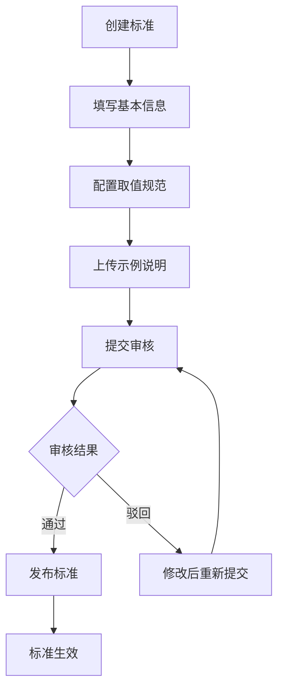

## 1. 产品概述

数据标准字典库是服务于数据治理团队的 Web 应用，用于统一维护字段命名和取值规范，提升数据资产的一致性和可用性。

- 核心目标：建立企业级数据标准，统一字段命名、数据类型和取值规范，解决数据孤岛和口径不一致问题
- 目标用户：数据治理专员、数据架构师、业务分析师、开发工程师
- 产品价值：降低数据沟通成本，提升数据质量，加速数据项目交付

## 2. 核心功能

### 2.1 用户角色

| 角色 | 核心权限 |
|------|----------|
| 数据治理专员 | 标准创建、编辑、提交审核、映射管理、导出 |
| 审核人员 | 标准审核、发布、停用、冲突标记 |
| 普通用户 | 标准查询、引用查询、导出使用 |

### 2.2 功能模块

1. **标准目录**：按业务主题分类浏览标准列表，支持搜索筛选
2. **标准详情**：维护标准的完整信息，包括名称、类型、取值、示例等
3. **映射管理**：关联已有系统字段，标记冲突字段，批量搜索替换建议
4. **审核发布**：标准审核流程、发布/停用状态管理
5. **引用查询**：查看标准被引用范围，导出标准字典

### 2.3 页面详情

| 页面名称 | 模块名称 | 功能描述 |
|---------|---------|----------|
| 标准目录 | 主题分类树 | 按业务主题层级展示标准分类 |
| 标准目录 | 标准列表 | 表格展示标准列表，支持排序、筛选、搜索 |
| 标准目录 | 统计概览 | 展示标准总数、已发布、待审核等统计数据 |
| 标准详情 | 基本信息 | 中文名、英文名、业务主题、数据类型、长度 |
| 标准详情 | 取值配置 | 允许值列表、默认值、取值范围、正则校验 |
| 标准详情 | 示例说明 | 示例值、使用说明、上传附件 |
| 标准详情 | 操作栏 | 编辑、提交审核、删除等操作 |
| 映射管理 | 字段映射列表 | 展示系统字段与标准的映射关系 |
| 映射管理 | 冲突标记 | 标记存在命名或取值冲突的字段 |
| 映射管理 | 批量替换建议 | 智能推荐可替换为标准的字段 |
| 审核发布 | 待审核列表 | 待审核标准列表，支持批量审核 |
| 审核发布 | 审核操作 | 通过/驳回，填写审核意见 |
| 审核发布 | 发布管理 | 已发布/已停用标准管理，支持状态切换 |
| 引用查询 | 引用范围 | 展示标准在各系统/表中的引用情况 |
| 引用查询 | 引用统计 | 按系统、按主题统计引用数量 |
| 引用查询 | 导出功能 | 导出标准字典 Excel/CSV 给项目组使用 |

## 3. 核心流程

### 3.1 标准创建发布流程

数据治理人员创建标准 → 填写基本信息和取值规范 → 配置示例说明 → 提交审核 → 审核人员审核 → 审核通过后发布 → 标准生效可被引用

### 3.2 字段映射流程

选择业务系统 → 导入字段列表 → 自动匹配标准 → 人工确认映射关系 → 标记冲突字段 → 生成替换建议

## 4. 用户界面设计

### 4.1 设计风格

- **主色调**：深蓝 + 青绿渐变，体现数据专业感和科技感
- **辅助色**：橙色用于强调操作，绿色表示正常/通过，红色表示警告/冲突
- **按钮风格**：圆角矩形，轻微阴影，hover 有上浮效果
- **字体**：无衬线现代字体，标题加粗有层次感
- **布局风格**：左侧导航 + 顶部工具栏 + 主内容区，卡片式布局
- **图标风格**：线性图标，简洁清晰

### 4.2 页面设计概述

| 页面名称 | 模块名称 | UI 元素 |
|---------|---------|--------|
| 标准目录 | 主题分类树 | 树形结构，可折叠展开，选中高亮 |
| 标准目录 | 标准列表 | 数据表格，斑马纹，hover 高亮，状态标签 |
| 标准目录 | 统计卡片 | 四个指标卡片，渐变背景，数字动画 |
| 标准详情 | 信息分区 | 分组卡片展示，分区标题，标签页切换 |
| 标准详情 | 取值配置 | 动态增删行，下拉选择，颜色标签 |
| 映射管理 | 映射关系 | 左右两列对比，连线动画，冲突红色标记 |
| 审核发布 | 审核流程 | 时间线展示审核历史，状态进度条 |
| 引用查询 | 引用图谱 | 可视化引用关系，气泡图展示 |

### 4.3 响应式设计

- 桌面端优先，适配 1440px 及以上宽度
- 平板端：左侧导航可收起为图标模式
- 移动端：底部标签导航，表格横向滚动
- 触控优化：按钮最小 44px 点击区域

### 4.4 交互动效

- 页面加载：元素渐入 + 轻微上移动画
- 表格行：hover 时背景色渐变过渡
- 状态切换：平滑过渡动画
- 模态框：缩放 + 淡入效果
- 侧边栏：滑入滑出动效
