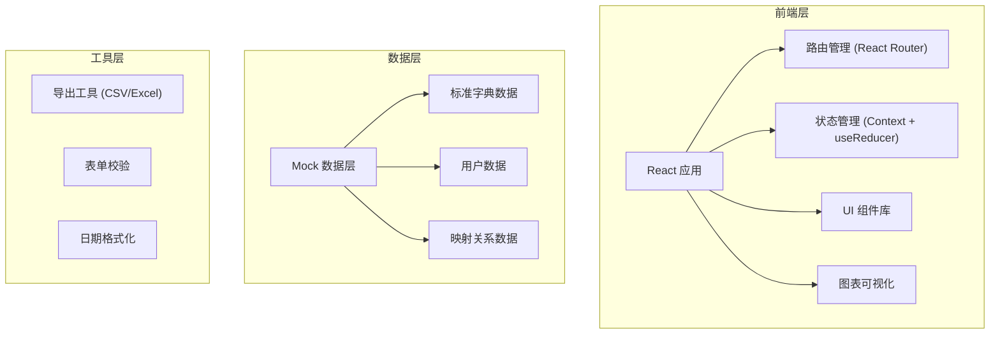
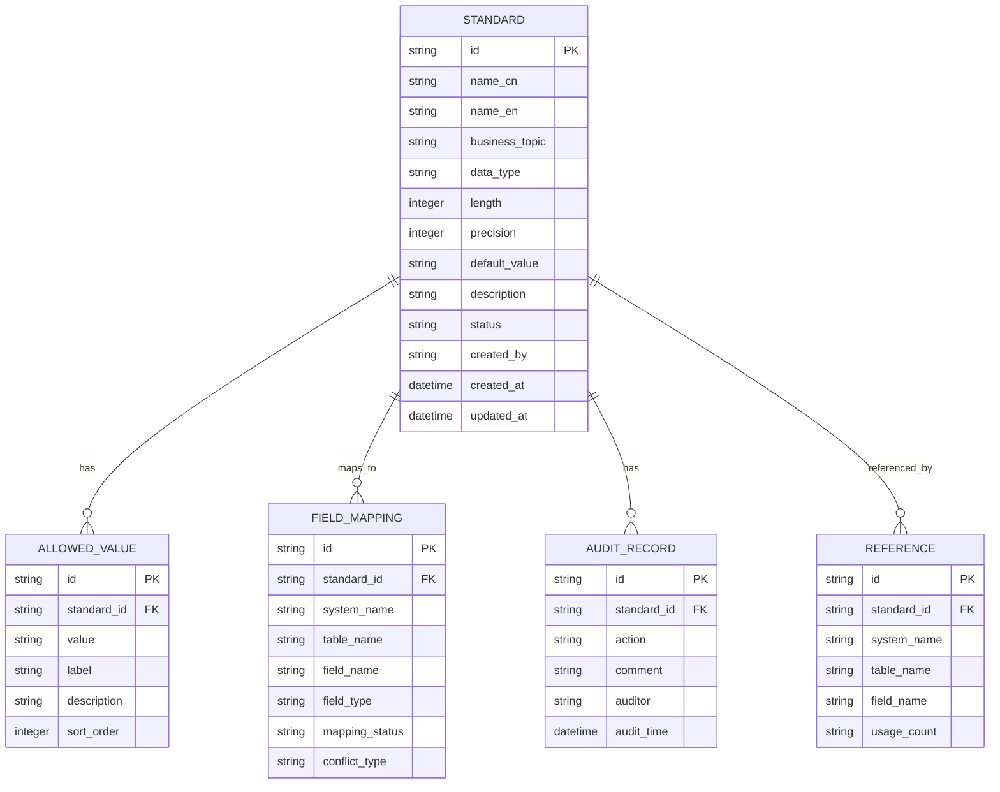

## 1. 架构设计



## 2. 技术描述

- **前端框架**：React@18 + TypeScript
- **构建工具**：Vite
- **样式方案**：TailwindCSS 3
- **路由管理**：React Router v6
- **状态管理**：React Context + useReducer
- **图标库**：Lucide React
- **图表库**：Recharts
- **Mock 数据**：本地 JSON 数据

## 3. 路由定义

| 路由 | 页面 | 说明 |
|-----|------|------|
| `/` | 标准目录 | 首页，展示标准列表和分类 |
| `/standard/:id` | 标准详情 | 查看/编辑标准详情 |
| `/standard/new` | 新建标准 | 创建新的数据标准 |
| `/mapping` | 映射管理 | 字段映射和冲突管理 |
| `/audit` | 审核发布 | 审核和发布管理 |
| `/reference` | 引用查询 | 引用查询和导出 |

## 4. 数据模型

### 4.1 数据模型定义



### 4.2 数据结构定义

```typescript
// 数据标准
interface DataStandard {
  id: string;
  nameCn: string;
  nameEn: string;
  businessTopic: string;
  dataType: 'string' | 'number' | 'date' | 'boolean' | 'text';
  length: number;
  precision: number;
  defaultValue: string;
  description: string;
  status: 'draft' | 'pending' | 'published' | 'deprecated';
  allowedValues: AllowedValue[];
  example: string;
  attachments: Attachment[];
  createdBy: string;
  createdAt: string;
  updatedAt: string;
}

// 允许值
interface AllowedValue {
  id: string;
  value: string;
  label: string;
  description: string;
  sortOrder: number;
}

// 业务主题
interface BusinessTopic {
  id: string;
  name: string;
  parentId: string | null;
  children?: BusinessTopic[];
  standardCount: number;
}

// 字段映射
interface FieldMapping {
  id: string;
  standardId: string | null;
  systemName: string;
  tableName: string;
  fieldName: string;
  fieldType: string;
  mappingStatus: 'mapped' | 'unmapped' | 'conflict';
  conflictType?: 'name' | 'type' | 'value' | null;
  suggestedStandardId?: string;
  similarity?: number;
}

// 审核记录
interface AuditRecord {
  id: string;
  standardId: string;
  action: 'submit' | 'approve' | 'reject' | 'publish' | 'deprecate';
  comment: string;
  operator: string;
  operateTime: string;
}

// 引用记录
interface Reference {
  id: string;
  standardId: string;
  systemName: string;
  tableName: string;
  fieldName: string;
  usageCount: number;
  lastUsed: string;
}
```

## 5. 目录结构

```
src/
├── components/          # 通用组件
│   ├── Layout/         # 布局组件
│   ├── Table/          # 表格组件
│   ├── Modal/          # 模态框
│   ├── StatusTag/      # 状态标签
│   └── SearchBar/      # 搜索框
├── pages/              # 页面组件
│   ├── StandardList/   # 标准目录
│   ├── StandardDetail/ # 标准详情
│   ├── Mapping/        # 映射管理
│   ├── Audit/          # 审核发布
│   └── Reference/      # 引用查询
├── data/               # Mock 数据
│   ├── standards.ts
│   ├── topics.ts
│   ├── mappings.ts
│   └── references.ts
├── hooks/              # 自定义 Hooks
│   ├── useStandards.ts
│   ├── useTopics.ts
│   └── useMappings.ts
├── types/              # TypeScript 类型
│   └── index.ts
├── utils/              # 工具函数
│   ├── export.ts       # 导出工具
│   ├── format.ts       # 格式化
│   └── validation.ts   # 校验
├── App.tsx
├── main.tsx
└── index.css
```

## 6. 核心功能实现思路

### 6.1 标准目录
- 左侧树形组件展示业务主题分类
- 右侧数据表格展示标准列表
- 支持按主题筛选、关键词搜索、状态筛选
- 顶部统计卡片展示核心指标

### 6.2 标准详情
- 标签页切换：基本信息、取值规范、示例说明、映射关系、审核记录
- 表单编辑模式，支持动态增删允许值
- 文件上传示例附件（模拟）

### 6.3 映射管理
- 左右对比布局：系统字段 vs 标准字段
- 自动匹配算法：基于名称相似度推荐映射
- 冲突标记：红色高亮显示冲突字段
- 批量操作：批量确认映射、批量标记冲突

### 6.4 审核发布
- 待审核、已发布、已停用三个 Tab
- 审核操作：通过/驳回，填写审核意见
- 时间线展示审核历史

### 6.5 引用查询
- 搜索标准查看引用范围
- 按系统、按主题统计引用数量
- 导出功能：CSV/Excel 格式导出
